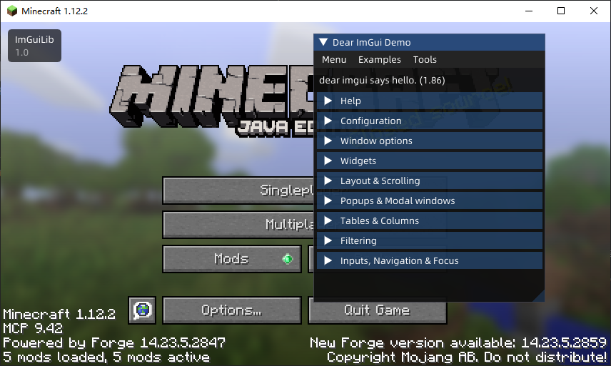
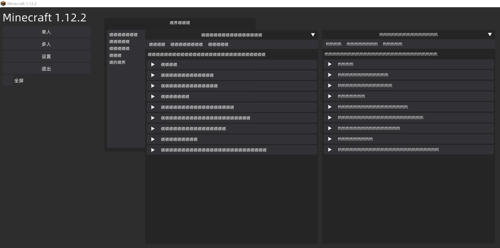

## ImGuiLib Forge 1.12.2 

此库提供了一个ImGui绘制实现,可以在Minecraft(Forge) 1.12.2中使用ImGui



### 特别说明

本Lib只测试了Windows环境下的运行情况

需要在Screen中处理键盘输入和鼠标事件,以下是一个简单窗口绘制

```java
public class MyGuiScreen extends GuiScreen{
    @Override
    public void drawScreen(int mouseX, int mouseY, float partialTicks) {
        super.drawScreen(mouseX, mouseY, partialTicks);
        ImGuiImpl.draw(io -> {
            ImGui.showDemoWindow();
        });
    }

    @Override
    public void handleKeyboardInput() throws IOException {
        super.handleKeyboardInput();
        ImGuiImpl.handleKey(); // 需要手动在此处调用此方法处理按键消息
    }
    
    @Override
    public void handleMouseInput() throws IOException {
        super.handleMouseInput();
        ImGuiImpl.handleMouse();// 需要手动在此处调用此方法处理鼠标滚轮等消息
    }
}
```

### 引用的代码

[fabric-imgui-example-mod]("https://github.com/FlorianMichael/fabric-imgui-example-mod")

[imgui-lwjgl2]("https://github.com/factrick45/imgui-lwjgl2")

### 示例代码

<details>
  <summary>ImGui初始化事件 & 事件注册</summary>

`MyMod.java`
```java
@Mod(modid = Tags.MOD_ID, version = Tags.VERSION, dependencies = "required:imlib@[1.0,);")
public class MyMod {
    public static final Logger LOGGER = LogManager.getLogger(Tags.MOD_ID);

    @Mod.EventHandler
    public void preInit(FMLPreInitializationEvent event){
        ImGuiImpl.registerCallBack(new ImGuiInit());
    }
}
```

`ImGuiInit.java`
```java
public class ImGuiInit implements ImGuiInitInterface {
    public static ImFont FONT_TITLE_48;
    public static ImFont FONT_TITLE_36;
    public static ImFont FONT_TITLE_28;

    @Override
    public void preInit() { // 创建Imgui上下文后执行
    }

    @Override
    public void loadFont(ImFontAtlas imFontAtlas, short[] shorts) throws IOException { // 加载字体
        FONT_TITLE_48 = imFontAtlas.addFontFromMemoryTTF(
                IOUtils.toByteArray(Objects.requireNonNull(ImLib.class.getResourceAsStream("/assets/imlib/fonts/Alibaba-PuHuiTi-Regular.ttf"))),
                48,
                ImGuiImpl.getGlyphRangesChineseFull()
        );
        FONT_TITLE_36 = imFontAtlas.addFontFromMemoryTTF(
                IOUtils.toByteArray(Objects.requireNonNull(ImLib.class.getResourceAsStream("/assets/imlib/fonts/Alibaba-PuHuiTi-Regular.ttf"))),
                36,
                ImGuiImpl.getGlyphRangesChineseFull()
        );
        FONT_TITLE_28 = imFontAtlas.addFontFromMemoryTTF(
                IOUtils.toByteArray(Objects.requireNonNull(ImLib.class.getResourceAsStream("/assets/imlib/fonts/Alibaba-PuHuiTi-Regular.ttf"))),
                28,
                ImGuiImpl.getGlyphRangesChineseFull()
        );
    }

    @Override
    public void postInit() { // ImGui初始化完毕
        // ImGuiImpl.styleDark(); // 设置黑色样式(美化过!)
    }
}
```
</details>

### 已知的问题

 - 在添加了启动参数`-Dfile.encoding=UTF-8`后可能导致窗口乱码

 

 - ImGuiConfigFlags.ViewportsEnable无法使用
